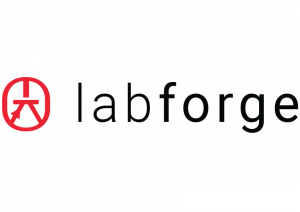

## Overview

This repository contains the Python SDK samples for [Bottlenose cameras](https://www.labforge.ca/features-bottlenose/),
and a C++ example for [stereo acquisition and calibration](calibrator/README.md).

The camera supports the GEV 2.1 standard and does work with major Machine Vision
software packages out of the box without additional drivers, please see our documentation
[here](https://docs.labforge.ca/docs/interfaces).

In this repository we provide samples for power users and integrators that want to work directly with the Camera 
without third-party frameworks. 

The samples allow depth and color streaming, and provide snippets to update intrinsic and extrinsic calibration 
information.

Bottlenose cameras necessary to use these samples library are available for 
purchase at [Mouser](https://www.mouser.ca/manufacturer/labforge/).

Please follow the steps to set up the [Bottlenose camera from our documentation](https://docs.labforge.ca/docs).

## Environment Setup

Please see the [releases](https://github.com/labforge/sdk-demos/releases/) page 
for the necessary **Pleora eBUS SDK** for your target platform. 

Please see the ```requirements.txt``` file in each sample directory for the
required python packages to run.

### Microsoft Windows

Note the Python backend for Microsoft Windows systems does not install Python
support by default. Please [install the following wheels](https://packaging.python.org/en/latest/tutorials/installing-packages/)
for your respective Python version.

| ***Python Version*** | ***Matching Wheel***                   |
|----------------------|----------------------------------------|
| 3.6.x (*)            | ebus_python-*-py36-none-win_amd64.whl  |
| 3.7.x                | ebus_python-*-py37-none-win_amd64.whl  |
| 3.8.x                | ebus_python-*-py38-none-win_amd64.whl  |
| 3.8.x                | ebus_python-*-py39-none-win_amd64.whl  |
| 3.10.x               | ebus_python-*-py310-none-win_amd64.whl |

(*) Some of the examples included in this repository use [Pyside6](https://doc.qt.io/qtforpython-6/PySide6/QtWidgets/index.html)
and require a newer version than Python 3.6.

### Ubuntu Linux

We provide support for Ubuntu Linux. To install the SDK including Python packages
please install corresponding Debian package (.dpkg).

```bash
sudo dpkg -i eBUS_SDK_Ubuntu-<Ubuntu version>-*.deb
```

The corresponding libraries will automatically be installed to

```bash
/opt/pleora/ebus_sdk/Ubuntu-<Ubuntu version>/lib/
```

Use this helper script to include the libraries in your environment

```bash
source /opt/pleora/ebus_sdk/Ubuntu-<Ubuntu version>/bin/set_puregev_env.sh
```

## Python Code Samples

| ***Sample***                            | ***Applicable Device(s)*** |
|-----------------------------------------|----------------------------|
| [Stream](stream/README.md)              | Mono, Stereo               |
| Stereo                                  | Stereo                     |
| Keypoints                               | Mono, Stereo               |
| ImageProcessing                         | Mono, Stereo               |
| [Utility](utility/README.md)            | Mono, Stereo               |
| [Driver](driver/README.md)              | Mono, Stereo               |
| [distribution](distribution/README.md)  | Mono, Stereo               |

## Python API Documentation

The API documentation corresponding to the latest SDK release can be found
in ```api_docs.zip``` the [releases section of this repository](https://github.com/labforge/sdk-demos/releases/).


## License
This project is licensed under the [Apache License, Version 2.0](LICENSE).